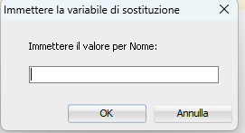
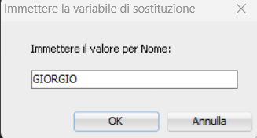
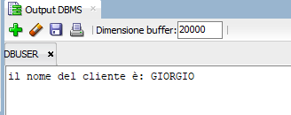

# PL/SQL
---
---
## INTRODUZIONE 
---
PL sta per Procedural Language ed è quindi un linguaggio PROCEDURALE per applicazioni flessibili che garantisce strumenti per la gestione,manipolazione e analisi dei dati in un ecosistema Oracle DB

È un linguaggio di ALTO LIVELLO che permette la creazione di: 
* funzioni
* trigger 
* Stored Procedure 
* Controllo del Flusso del codice ( if else )
* Gestione degli errori che possono risultare da blocchi di codice  

Consente la creazione di Tipi di dati personalizzati
Il linguaggio PL/SQL serve a sviluppare procedure e funzioni **SOLO** in un DB Oracle ed è necessario per migliorare le prestazioni del DB.

---
## LEZIONE 1 : BASI DI SQL , BLOCCHI E VARIABILI
---
(SEZIONE 4)

---
### BLOCCHI DI CODICE 

Servono a  raggruppare istruzioni e organizzare la logica del codice
Ne esistono di 4 tipi :
* *ANONIMI* → Non hanno nome e vengono eseguiti solo una volta; non      vengono salvati nel dbms ma è possibile salvarli in file per riutilizzarli
* *PROCEDURE* → Viene eseguito ogni volta che viene chiamato nel codice principale 
* *FUNZIONI* → Come le Procedure ma hanno un output 
* *PACHETTI* → Sono Gruppi di Procedure e Funzioni correlate.

I Blocchi sono divisi in SEZIONI 
Ogni Sezione ha questa sintassi:
<center> DICHIARAZIONE </center>
  <center>            ⬇</center>
<center>ESECUZIONE</center>
   <center>            ⬇</center>
<center>TERMINE </center>

Nell Foglio di lavoro in SQL tutto ciò si traduce in 

```sql   
DECLARE 
--Dichiarazione delle variabili
BEGIN 
--inizio procedure e modifica variabili
END;
-- fine del blocco
/* commento
    multi 
    riga */
```
---
### VARIABILI PL/SQL 
Come in tutti i linguaggi di programmazione le variabili sono parte centrale dell'esecuzione di codice, sono utilizzate per memorizzare e manipolare i dati all' interno del programma.

PL/SQL è strettamente tipato ovvero durante la dichiarazione delle variabili è necessario specificare il tipo di dato.

i tipi delle variabili sono quelli dei dati delle tabel in SQL ovvero:

| Tipo di Dato       | Descrizione                                       | Esempio                  |
|--------------------|---------------------------------------------------|--------------------------|
| CHAR(n)            | Stringa di lunghezza fissa fino a n caratteri     | CHAR(10)                 |
| VARCHAR(n)         | Stringa di lunghezza variabile fino a n caratteri | VARCHAR(255)             |
| NCHAR(n)           | Stringa Unicode di lunghezza fissa fino a n caratteri | NCHAR(10)              |
| NVARCHAR(n)        | Stringa Unicode di lunghezza variabile fino a n caratteri | NVARCHAR(255)         |
| NUMBER(p, d)       | Numero a virgola mobile con precisione p e scala d | NUMBER(10, 2)            |
| FLOAT              | Numero in virgola mobile a precisione doppia      | FLOAT                    |
| BINARY_FLOAT       | Numero in virgola mobile a precisione singola     | BINARY_FLOAT             |
| BINARY_DOUBLE      | Numero in virgola mobile a precisione doppia      | BINARY_DOUBLE            |
| DATE               | Data (senza ora)                                  | '2024-04-13'             |
| TIMESTAMP          | Data e ora con fuso orario                        | '2024-04-13 12:34:56'    |
| CLOB               | Dati di grandi dimensioni di tipo carattere       | CLOB                     |
| BLOB               | Dati di grandi dimensioni di tipo binario         | BLOB                     |
| BFILE              | Riferimento a un file binario esterno             | BFILE                    |


Passiamo adesso alla dichiarazione di variabili in PL/SQL, segue sempre la sitassi 
NOME TIPODATO;
ovvero

```sql
P_NomeVariabile TIPODATO;
--Esempio 
P_NomeCliente VARCHAR(10);
```  
È Possibile dichiarare e inizializzare le variabili insieme :

```sql
P_NomeCliente VARCHAR(10):= 'GIORGIO';

```  
È anche possibile eseguire quella che viene definita procedura di **ANCHORING** 

```sql
P_NomeCliente CLIENTE.NOME%TYPE;
-- o anche con inizializzazione 
P_COgnomeCliente CLIENTE.COGNOME%TYPE:='ROSSI';

```  
L'ANCHORING permette quindi di dichiarare una variabile con il tipo di dato corrispondente al dato specificato dal %TYPE ovvero lo stesso tipo di dato di quel campo in quella tabella seguendo la sintassi **TABELLA.COLONNA%TYPE** in modo da avere corrispondenza tra i due e facilitare sia inserimento che assegnazione.

Un altro tipo di dichiarazione dato è quella dove l'**UTENTE** assegna direttamente il valore a quella variabile tramite l'utilizzo del simbolo & seguito dal nome che vogliamo far comparire a schermo:


```sql
DECLARE 
P_NomeNuovoCliente CLIENTE.NOME%TYPE := '&Nome';
```  
Questo risulterà in un prompt all'avvio del blocco di codice dove l'utente avrà modo di inserire il nome scelto. Una volta fatto ciò per tutta la durata dell'esecuzione del codice quella variabile avrà quel valore.


 
se nel blocco inseriamo anche il comando 


```sql
BEGIN 
dbms_output.put_line('il nome del cliente è: ' || p_NomeNuovoCliente);
END;
```  
ci troveremo nell'output DBMS proprio il nome che abbiamo scritto 




---
### MANIPOLAZIONE DELLE VARIABILI

Come in ogni linguaggio la manipolazione delle variabili è essenziale.
Anche il PL/SQL è possibile manipolare le variabili ad esempio:
* è possibile usare funzioni matematiche sia nella dichiarazione delle stesse che nel blocco delle procedure 

```sql
P_TotaleAcquisti = SUM(P_ACQUISTI * 3);
```  

* è possibile assegnare valori da dati presi direttamente tramite una QUERY 
```sql
DECLARE 
  P_NOME CLIENTI.NOME%TYPE;
BEGIN 
  SELECT NOME INTO P_NOME FROM CLIENTI WHERE NOME = 'GIORGIO';
```  
ovviamente le condizioni del where possono cambiare andando a prendere informazioni piu complesse.

* è possibile inserire direttamente le variabili ( magari rielaborate nelle procedure ) nelle tabelle come nuove entità


```sql
INSERT INTO CLIENTE (NOME,COGNOME) VALUES (P_NOME,P_COGNOME);
```  
Queste inserzioni saranno poi approfondite, in particolare il concetto di conferma delle modifiche.

---
### BLOCCHI ANNIDIATI E SCOPE DELLE VARIABILI

I Blocchi Annidiati non sono altro che blocchi dentro la parte "*BEGIN*" di un altro blocco

```sql
DECLARE 
BEGIN
-- blocco annidiato 
  DECLARE
  BEGIN
  END --fine blocco annidiato, riprende il blocco principale
END   
```  
Le variabili dichiarate nel blocco principale saranno visibili al blocco annidiato ma non è vero il contrario

```sql
DECLARE 
  VAR NUMBER :=6;
BEGIN 
  DECLARE 
    VAR2 NUMBER :=3;
  BEGIN
    dbms_output.put_line(VAR + VAR 2 = || VAR+ VAR2); 
    -- (6+3) e stamperà a video il risultato
  END 
  dbms_output.put_line(VAR + VAR 2 = || VAR+ VAR2); 
  -- darà errore , VAR2 non esiste e non è stata neanche dichiarata per il blocco principale
  END;
```  
È anche possibile nominare variabili nello stesso modo sia nel blocco interno che in quello esterno ma in quel caso i valori di assegnazione avranno preceenza quelli del blocco interno
```sql
DECLARE 
VAR NUMBER :=1;
BEGIN 
  DECLARE
  VAR NUMBER :=2;
  BEGIN
  dbms_output.put_line(VAR = || VAR); 
  -- darà come risultato '2'
  END
dbms_output.put_line(VAR = || VAR); 
-- darà come risultato '1'
END;  
```  
Per evitare confusioni è possibile usare le **ETICHETTE**

```sql
<<PRIMARIO>>
DECLARE 
BEGIN 
  <<SECONDARIO>>
  DECLARE 
  BEGIN 
  END
END; 
``` 
in questo caso il chiamare le variabili saraà analogo al chiamare un campo in una tabella :
 
```sql
primario.VAR1 ;
secondario.VAR2;
```  
Ovviamente l'etichetta del blocco annidiato **NON** esisterà per il blocco Principale.

---
---
## LEZIONE 2 : GESTIONE DELLE TRANSAZIONI
---
(SEZIONE 5)

---
Nel caso di errori durante l'esecuzione di blocchi di codice è necessario poter tornare indietro : per questo esiste il comando **ROLLBACK**
che permette di riportare il db all'ultimo salvataggio , scartando così le modifiche fatte in precedenza 
```sql
ROLLBACK;
```
Ma cosa si intende per modifica?

Ogni comando appartenente alla famiglia DML (Data Manipulation System) è considerato una modifica al DB (i metodi CRUD)
e ogni tipo di modifica è considerato **SOTTO TRANSAZIONE** ovvero finche il comando non viene accettato del tutto i cambiamenti sono salvati in una __memoria temporanea__ per preservare l'integrità del DB.

Non è infatti l'utente base a decidere ma la logica del programma decide se accettare o scartare le modifiche fatte dall'utente.

Gli utenti esterni infatti saranno in grado di modificare il db e i suoi dati ma non riusciranno a vedere le modifiche che hanno apportato , non finchè la transazione non sarà chiusa e il risultato confermato o ribaltato 

```sql
COMMIT;
```
Comando per accettare tutti i cambiamenti , proprio come in GIT;

IL COMMIT è PERMANENTE

```sql
SAVEPOINT a ;
```
È un checkpoint che salva le modifiche (NON è UN COMMIT), e serve come punto di riferimento per i successivi commit o rollback;

Il rollback infatti puo referenziare un savepoint scartando tutte le modifiche successive al savepoint
<center>OPERAZIONE</center>
<center> ⬇</center>
<center>SAVEPOINT 'X'</center>
<center>⬇</center>
<center>MORE WORK</center>
<center> ⬇</center>
<center>COMMIT OR ROLLBACK TO SAVEPOINT 'X'</center>

---
---
## LEZIONE 3 : ESPRESSIONI CONDIZIONALI
---
(SEZIONE 6)

---
Come in tutti i linguaggi di programmazione le espressioni condizionali sono una parte fondamentale del flusso del codice per eseguire determinate azioni quando una condizione è vera e altre azioni quando è falsa.

In PL/SQL sono :

* **IF THEN ELSE** 
  
  questa la sintassi:

```sql
IF (condizione) THEN Azione1
ELSE IF (condizione2) THEN Azione2
ELSE  (Condizione implicita) 
      Azione 3
END IF;      
``` 
* **CASE** 

  Viene utilizzato per selezionare opzioni diverse in base ad un valore specifico (il SELETTORE)


```sql
CASE (Selettore)
WHEN (opzione1) THEN (azione1)
WHEN (opzione2) THEN (azione2)
ELSE (azione di base)
END CASE;
```
* COALESCE usato per restituire il *Primo* valore NON nullo di una lista di valori 
```sql
COALESCE (V1,V2,V3...Vn);
```
* SEARCHED CASE espressione avanzata del CASE per valutare più condizioni contemporaneamente non c'è quindi bisogno del selettore perla clausola CASE
```sql
CASE 
WHEN (condizione1)THEN azione1
WHEN (condizione2)THEN azione2
WHEN (condizione3)THEN azione3
END CASE;
```
* NULLIF  restituisce NULL se due valori sono uguali e altrimenti restituisce il PRIMO Valore 
```sql
NULLIF (V1,V2)
```
* NVL serve per "riempire" il valore nullo in una colonne (se trovato) con un valore da noi stabilito. Serve per eseguire funzioni matematiche su colonne che sappiamo potrebbero avere valori nulli.
```sql
NVL(SPESA,0);
```
È Anche possibile avere più condizioni una annidiata all'interno dell'altra 

```sql
IF condizione THEN 
      IF condizione THEN azione
      ELSIF condizione THEN azione
      ELSE azione
      END IF;
ELSIF condizione 
ELSE azione 
END IF;      
```